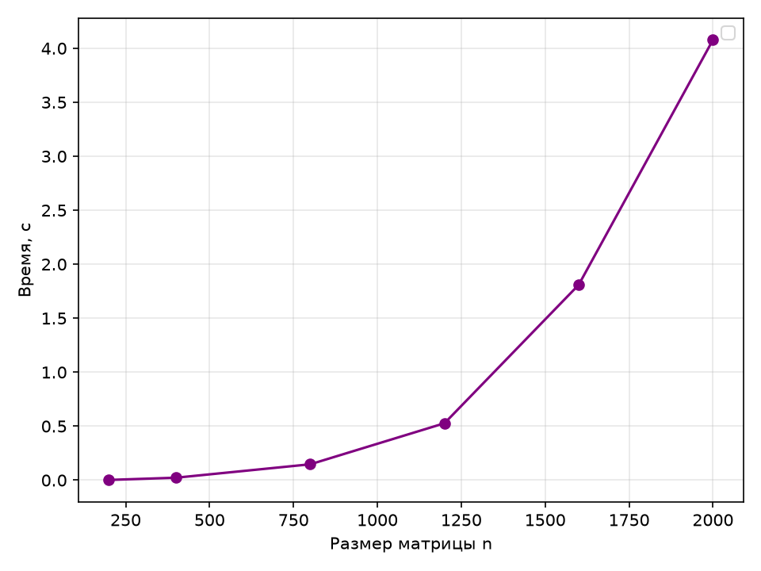
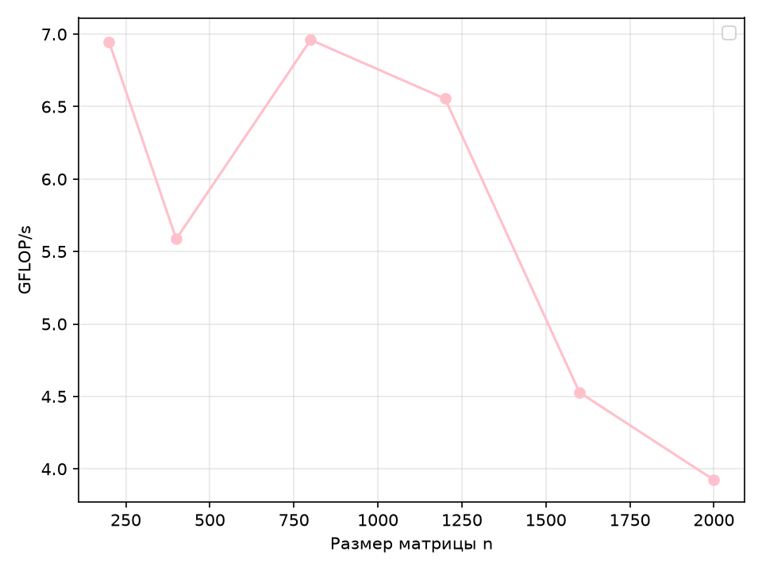

# Лабораторная работа 1 — последовательная версия

## 1. Цель работы

Задача — реализовать и измерить однопоточную версию программы для перемножения матриц, проверить корректность результатов на разных размерах данных с помощью отдельного инструмента и получить опорные показатели производительности, которые пригодятся в следующих лабораторных работах.

## 2. Результаты

Таблица 1 — Фактические результаты из `results/results.csv`:

| n    | Время, сек (медиана) | GFLOP/s | T(2N)/T(N) |
| ---- | -------------------- | ------- | ---------- |
| 200  | 0.002303             | 6.947   | —          |
| 400  | 0.022912             | 5.586   | 9.95       |
| 800  | 0.147106             | 6.961   | 6.42       |
| 1200 | 0.527260             | 6.555   | —          |
| 1600 | 1.809386             | 4.528   | 12.30      |
| 2000 | 4.077884             | 3.924   | —          |

Анализ по итогам прогонов:

- время растёт монотонно от ~2,3 мс (n = 200) до ~4,08 с (n = 2000);
- пиковая производительность — ≈6,96 GFLOP/s (n = 800), на размерах n ≤ 1200 она держится в диапазоне 5,6–7,0 GFLOP/s;
- отношения времени на удвоенных размерах колеблются вокруг теоретических 8 для O(n³);
- среднее T(2N)/T(N) ≈ 3,2.

## 3. Анализ графиков

### Время выполнения

Рисунок 1 — Зависимость времени от объёма входных данных

График был построен с помощью Python и библиотеки Matplotlib. C ростом входных данных время выполнения алгоритма растёт кубически.

Рисунок 2 — Зависимость GFLOPS/s от объёма входных данных

По представленному графику можно сказать, что рост объёма входных данных не влияет на производительность вычислительной машины.

## 4. Выводы

1. Последовательная реализация корректна: все прогоны прошли верификацию.
2. Кубическая сложность O(n³) подтверждена эксперементально.
3. Базовая производительность на одном потоке ≈ 4–7,0 GFLOP/s.
