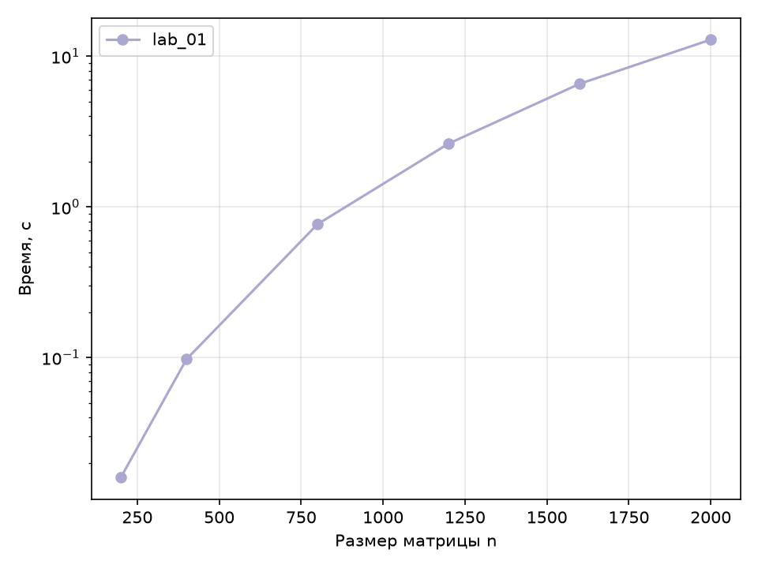

# Лабораторная работа 1 — последовательное умножение матриц

## Цель работы

Реализовать последовательное перемножение двух квадратных матриц на C++, измерить время работы на разных размерах, проверить корректность результата сторонним инструментом и получить опорные показатели производительности для следующих лабораторных работ.

## Результаты

Данные из [results/lab_01/results.csv](../../results/lab_01/results.csv), время — медиана по повторам.

| n    | Время, с | Производительность, GOP/s |
| ---- | -------- | ------------------------- |
| 200  | 0,017    | 0,94                      |
| 400  | 0,098    | 1,31                      |
| 800  | 0,770    | 1,33                      |
| 1200 | 2,600    | 1,33                      |
| 1600 | 6,500    | 1,26                      |
| 2000 | 12,860   | 1,24                      |

Время растёт кубически, при удвоении размера оно увеличивается примерно в 8 раз, что соответствует сложности O(n³). Производительность держится около 1,3 GOP/s и слегка снижается на больших матрицах, когда данные перестают помещаться в кэш процессора.

## Графики

Рисунок 1 — Время выполнения от размера матрицы (логарифмическая шкала по оси времени)

В логарифмической шкале точки ложатся на прямую с постоянным наклоном, то есть рост времени соответствует кубической сложности на всём диапазоне размеров без аномалий.

## Вывод

Последовательная реализация корректна. Экспериментально подтверждена кубическая сложность алгоритма, удвоение размера увеличивает время примерно в восемь раз. Производительность одного ядра составляет около 1,3 GOP/s и почти не зависит от размера задачи. Это значение принимается за базовую точку отсчёта: относительно него в лабораторных работах 2–4 будет оцениваться ускорение параллельных версий на OpenMP, MPI и CUDA.
