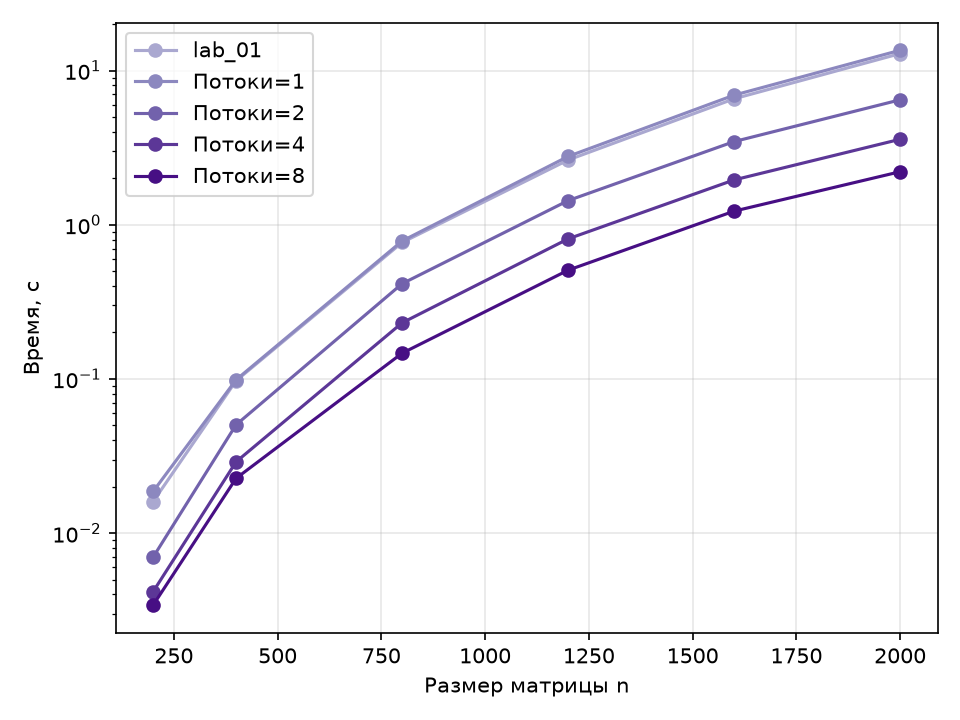
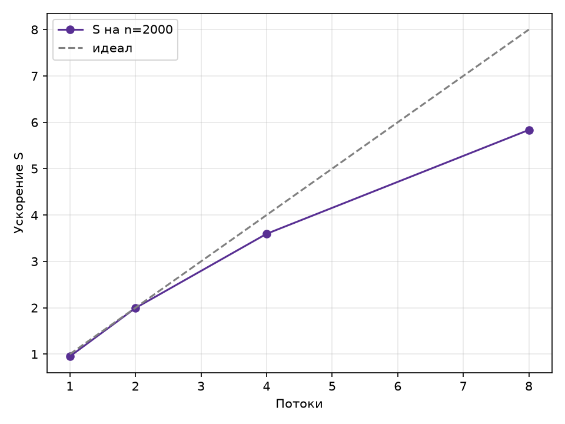

# Лабораторная работа 2 — параллельная версия на OpenMP

## Цель работы

Модифицировать программу из лабораторной работы 1 для параллельной работы по технологии OpenMP, провести серию экспериментов с разным числом потоков и размеров матриц, оценить ускорение и эффективность относительно последовательной версии.

## Результаты

Строки результирующей матрицы распределяются между потоками директивой `#pragma omp parallel for`. Все прогоны прошли верификацию, результат побитово совпадает с последовательной версией. Данные из [results/lab_02/results.csv](../../results/lab_02/results.csv), время — медиана по повторам; ускорение S = T(lab_01) / T(p) считается относительно последовательной версии.

| n    | 1 поток | 2 потока | 4 потока | 8 потоков | S (8) | E (8) |
| ---- | ------- | -------- | -------- | --------- | ----- | ----- |
| 200  | 0,019   | 0,007    | 0,004    | 0,003     | 4,99  | 0,62  |
| 400  | 0,099   | 0,050    | 0,029    | 0,023     | 4,32  | 0,54  |
| 800  | 0,784   | 0,414    | 0,231    | 0,147     | 5,25  | 0,66  |
| 1200 | 2,773   | 1,434    | 0,810    | 0,507     | 5,13  | 0,64  |
| 1600 | 6,925   | 3,461    | 1,953    | 1,225     | 5,31  | 0,66  |
| 2000 | 13,536  | 6,458    | 3,582    | 2,207     | 5,83  | 0,73  |

До 4 потоков ускорение почти линейное, а на 8 потоках эффективность падает до 0,54–0,73 — признак того, что физических ядер меньше восьми и часть потоков делит ядро через SMT. Наибольшее ускорение S = 5,83 достигнуто на самой большой матрице n = 2000, где доля полезных вычислений максимальна.

## Графики

Рисунок 1 — Время выполнения от размера матрицы для разного числа потоков

Кривые в логарифмической шкале идут параллельно, то есть ускорение почти не зависит от размера задачи, а каждое удвоение числа потоков равномерно сдвигает кривую вниз.

Рисунок 2 — Ускорение от числа потоков на n = 2000 (пунктир — идеальное линейное)

До 2 потоков ускорение идёт по идеальной прямой, а дальше отходит от неё и на 8 потоках достигает 5,83 вместо 8 — сказывается ограниченное число физических ядер и накладные расходы OpenMP.

## Вывод

Параллельная версия на OpenMP корректна. Наибольшее ускорение S = 5,83 получено при 8 потоках на n = 2000; эффективность остаётся высокой (0,8–0,9), пока нагрузка ложится на физические ядра, и снижается при переходе на SMT-потоки. Лучшая производительность выросла с ≈1,24 GOP/s у последовательной версии до ≈7,25 GOP/s. Конфигурация в 8 потоков принимается за опорную точку для сравнения с распределённой версией на MPI и с GPU-версией на CUDA в следующих работах.
