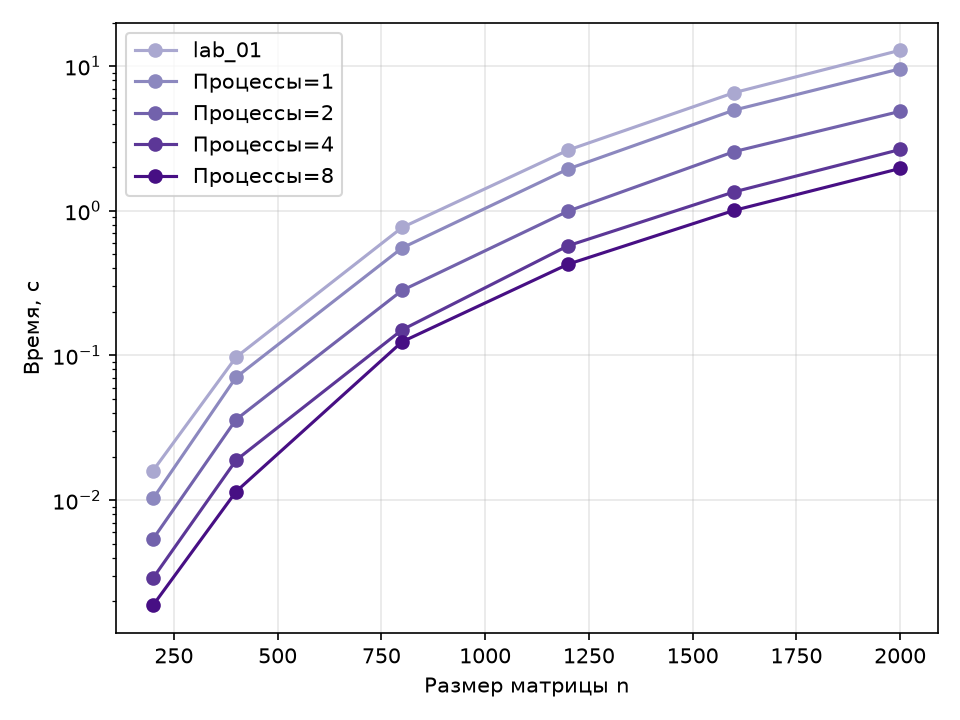
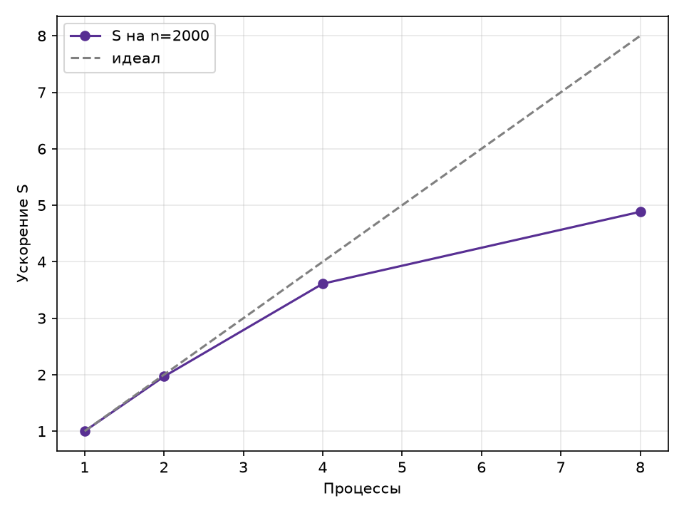

# Лабораторная работа 3 — параллельная версия на MPI

## Цель работы

Модифицировать программу из лабораторной работы 1 для параллельной работы по технологии MPI, провести серию экспериментов с разными размерами матриц и числом процессов и запустить параллельную версию на суперкомпьютере «Сергей Королёв».

## Результаты

Строки матрицы A распределяются между процессами (`MPI_Scatterv`), матрица B рассылается всем (`MPI_Bcast`), результат собирается на нулевом процессе (`MPI_Gatherv`); время замеряется `MPI_Wtime` и включает все пересылки.

Программа собрана Intel MPI и запущена через SLURM ([build.sh](../../scripts/slurm/build.sh), [job.sh](../../scripts/slurm/job.sh)), все процессы размещались на одном вычислительном узле. Все прогоны прошли верификацию. Данные из [results/lab_03/results.csv](../../results/lab_03/results.csv), время — медиана по трём повторам; ускорение S = T(1) / T(p) считается относительно одного процесса на том же узле.

| n    | 1 процесс, с | 2, с  | 4, с  | 8, с  | S (2) | S (4) | S (8) | E (8) |
| ---- | ------------ | ----- | ----- | ----- | ----- | ----- | ----- | ----- |
| 200  | 0,010        | 0,005 | 0,003 | 0,002 | 1,90  | 3,55  | 5,47  | 0,68  |
| 400  | 0,071        | 0,036 | 0,019 | 0,012 | 1,96  | 3,74  | 6,17  | 0,77  |
| 800  | 0,554        | 0,282 | 0,150 | 0,124 | 1,97  | 3,68  | 4,46  | 0,56  |
| 1200 | 1,947        | 0,995 | 0,574 | 0,428 | 1,96  | 3,39  | 4,55  | 0,57  |
| 1600 | 4,968        | 2,564 | 1,351 | 1,006 | 1,94  | 3,68  | 4,94  | 0,62  |
| 2000 | 9,580        | 4,869 | 2,653 | 1,962 | 1,97  | 3,61  | 4,88  | 0,61  |

На 2 и 4 процессах ускорение почти линейное на всех размерах. На 8 процессах эффективность падает до 0,56–0,77: все процессы делят память одного узла, а рассылка матрицы B каждому процессу занимает всё большую долю времени. Производительность выросла с ≈1,7 GOP/s на одном процессе до ≈8,2 GOP/s на восьми.

## Графики

Рисунок 1 — Время выполнения от размера матрицы для разного числа процессов

В логарифмической шкале кривые для 1, 2 и 4 процессов идут параллельно с равным шагом, то есть каждое удвоение числа процессов почти вдвое сокращает время на любом размере; кривая 8 процессов подходит к кривой 4 процессов ближе, особенно начиная с n = 800.

Рисунок 2 — Ускорение S = T(1) / T(p) от числа процессов на n = 2000 (пунктир — идеальное линейное)

До 2 процессов ускорение совпадает с идеальным (1,97), на 4 процессах немного отстаёт (3,61), а на 8 отходит от идеала заметно (4,88 вместо 8) — это предел, связанный с общей памятью узла и накладными расходами на коммуникации.

## Вывод

Распределённая версия на MPI корректна. Программа успешно запущена на суперкомпьютере «Сергей Королёв» через SLURM: на одном узле получено ускорение 1,97 на 2 процессах, 3,61 на 4 и 4,88 на 8 при n = 2000. По эффективности MPI близок к OpenMP из лабораторной работы 2 (5,83 на 8 потоках на ноутбуке): обе технологии упираются в пропускную способность памяти, а MPI дополнительно тратит время на пересылки, которые OpenMP не нужны благодаря общей памяти. Преимущество MPI проявляется при выходе за пределы одного узла — такой запуск на нескольких узлах кластера является естественным продолжением работы, а в лабораторной работе 4 то же умножение перенесено на GPU для сравнения с массовым параллелизмом CUDA.
