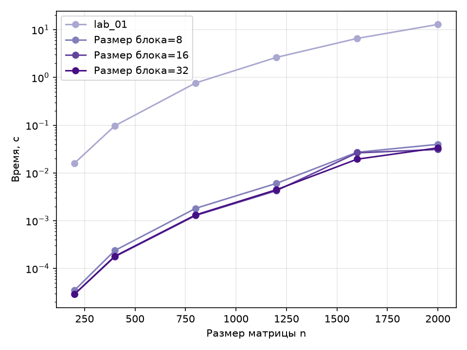
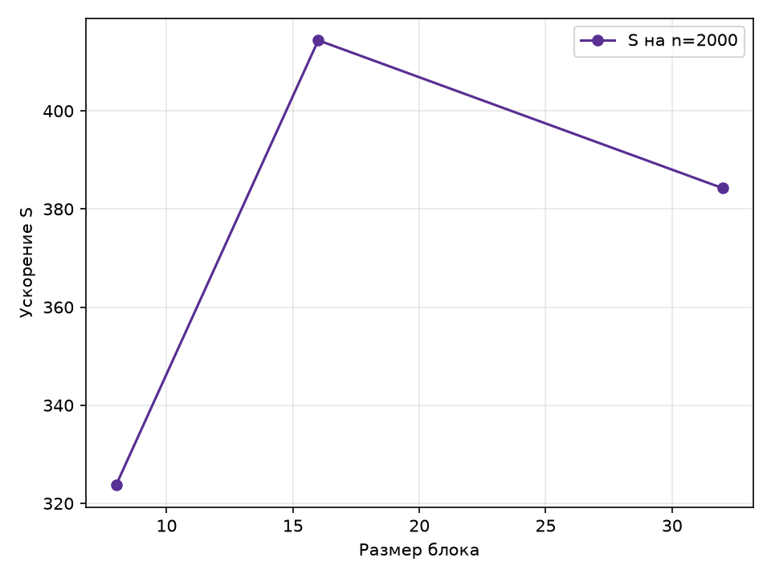

# Лабораторная работа 4 — параллельная версия на CUDA

## Цель работы

Модифицировать программу из лабораторной работы 1 для выполнения на GPU по технологии CUDA, провести эксперименты с разными размерами матриц и конфигурациями сетки блоков, оценить ускорение относительно последовательной версии и лучших CPU-версий.

## Результаты

Каждый поток GPU вычисляет один элемент матрицы C; блок — `b × b` потоков, сетка — `⌈n/b⌉ × ⌈n/b⌉` блоков, размер блока задаётся `BLOCK_SIZE`. Замеряется только время работы ядра (`cudaEvent`) после прогревочного запуска. Все прогоны прошли верификацию — результат совпал с эталоном numpy и с предыдущими версиями. Данные из [results/lab_04/results.csv](../../results/lab_04/results.csv), время — медиана по повторам.

| n    | b = 8, мс | b = 16, мс | b = 32, мс | GOP/s (b = 16) | S к lab_01 | S к OpenMP (8 потоков) |
| ---- | --------- | ---------- | ---------- | -------------- | ---------- | ---------------------- |
| 200  | 0,035     | 0,029      | 0,029      | 552            | 586        | 117                    |
| 400  | 0,238     | 0,173      | 0,181      | 742            | 568        | 132                    |
| 800  | 1,816     | 1,290      | 1,323      | 794            | 597        | 114                    |
| 1200 | 6,045     | 4,256      | 4,458      | 812            | 611        | 119                    |
| 1600 | 27,103    | 16,543     | 19,439     | 495            | 393        | 74                     |
| 2000 | 39,779    | 33,372     | 33,511     | 479            | 385        | 66                     |

Лучший размер блока на всех размерах — 16×16, блок 32×32 отстаёт не более чем на 5–15%, а блок 8×8 медленнее на 20–60%. Ускорение относительно последовательной версии составляет ≈570–610 раз до n = 1200, после чего производительность падает с ≈810 до ≈480 GOP/s, а разброс времени между повторами растёт.

## Графики

Рисунок 1 — Время выполнения от размера матрицы для разных размеров блока

Кривые GPU лежат на 2,5–3 порядка ниже последовательной версии и почти сливаются для блоков 16 и 32; излом на n = 1600 показывает, что при большом объёме данных рабочий набор матриц перестаёт помещаться в кэш GPU и ядро упирается в пропускную способность памяти.

Рисунок 2 — Ускорение относительно последовательной версии в зависимости от размера блока, n = 2000

Ускорение растёт с 323 при блоке 8×8 до 385 при 16×16 и не меняется при 32×32: блок 8×8 заполняет варпы лишь частично по строке матрицы и хуже объединяет обращения к памяти, а начиная с 16×16 доступ к памяти уже эффективен.

## Вывод

Реализация на CUDA корректна. Лучшая конфигурация — блок 16×16, дающий ускорение ≈385–610 раз относительно последовательной версии и ≈66–130 раз относительно лучшей CPU-конфигурации OpenMP из лабораторной работы 2 (8 потоков, S = 5,83). Размер блока влияет умеренно, пока он не меньше 16×16, а спад производительности на n ≥ 1600 и разброс между повторами связаны с переходом в режим, ограниченный пропускной способностью памяти, и изменением частот GPU под нагрузкой, а не с алгоритмом.

Итог всей серии лабораторных работ:
Последовательная версия задаёт базу, OpenMP и MPI дают ускорение в пределах числа ядер CPU, а CUDA за счёт массового параллелизма GPU обеспечивает выигрыш на два-три порядка.
