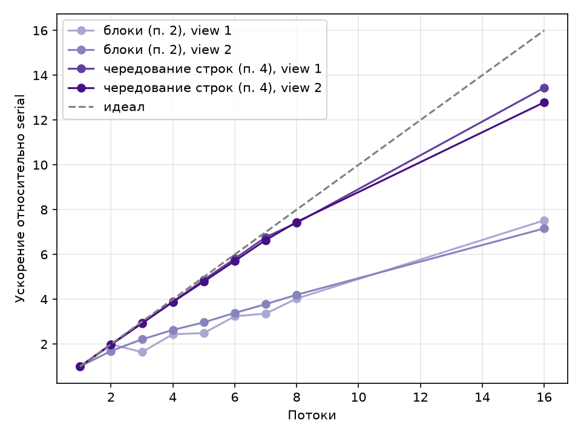

# Лабораторная работа 5 — параллельная генерация фрактала Мандельброта (CS149 asst1, Program 1)

## Цель работы

Распараллелить генерацию изображения множества Мандельброта с помощью `std::thread` из задания [Stanford CS149 asst1, Program 1](https://github.com/stanford-cs149/asst1): реализовать пространственное разбиение изображения между потоками, измерить ускорение для 2–8 и 16 потоков, найти причину нелинейного ускорения и подобрать разбиение, дающее ускорение ≈7–8× на обоих видах фрактала.

Изменён только `workerThreadStart()` в [src/lab_05/mandelbrotThread.cpp](../../src/lab_05/mandelbrotThread.cpp)

## Результаты

Все прогоны прошли встроенную проверку `main.cpp` — изображение совпадает с последовательной версией. Данные из [results/lab_05/results.csv](../../results/lab_05/results.csv), время каждого потока — [thread_times.txt](../../results/lab_05/thread_times.txt).

Таблица 1 — Ускорение относительно последовательной версии

| Потоки | Блоки, view 1 | Блоки, view 2 | Чередование, view 1 | Чередование, view 2 |
| ------ | ------------- | ------------- | ------------------- | ------------------- |
| 2      | 1,99          | 1,69          | 1,99                | 1,97                |
| 3      | 1,64          | 2,21          | 2,96                | 2,92                |
| 4      | 2,44          | 2,63          | 3,89                | 3,88                |
| 5      | 2,49          | 2,97          | 4,87                | 4,79                |
| 6      | 3,24          | 3,39          | 5,81                | 5,71                |
| 7      | 3,36          | 3,78          | 6,77                | 6,64                |
| 8      | 4,03          | 4,20          | 7,41                | 7,45                |
| 16     | 7,52          | 7,16          | 13,44               | 12,79               |

Таблица 2 — Время работы потоков при блочном разбиении

| Потоки | Время по потокам, мс                                | max / min |
| ------ | --------------------------------------------------- | --------- |
| 2      | 150,9 · 151,7                                       | 1,0       |
| 3      | 59,4 · **182,1** · 60,2                             | 3,1       |
| 4      | 28,7 · 122,8 · 122,9 · 30,0                         | 4,3       |
| 8      | 5,7 · 24,5 · 50,1 · 74,7 · 75,3 · 50,5 · 25,0 · 5,7 | 13,3      |

При блочном разбиении ускорение нелинейно, на 8 потоках всего 4,03, а на 3 потоках 1,64×, даже меньше, чем на 2.

Причина видна в таблице 2. Центральная полоса изображения содержит самую дорогую часть фрактала, и средний поток работает в 3 раза дольше крайних, а общее время определяется самым медленным потоком. Чередование строк выравнивает нагрузку и даёт 7,41 и 7,45 на 8 потоках для view 1 и view 2 — почти линейно.

## Графики

Рисунок 1 — Ускорение от числа потоков для двух способов разбиения и двух видов фрактала

Кривые чередования строк практически лежат на идеальной прямой до 8 потоков (эффективность 0,93), а блочные кривые идут вдвое ниже и проседают на 3 и 5 потоках для view 1, где одна из полос забирает основную часть работы.

## Вывод

1. **Пункты 1–2.** Блочное пространственное разбиение работает корректно, но ускорение нелинейно. 4,03 на 8 потоках для view 1, с провалом на 3 потоках. На 2 потоках ускорение почти идеальное, потому что view 1 симметричен относительно горизонтальной оси и обе половины одинаково дорогие.
2. **Пункт 3.** Стоимость строки пропорциональна яркости пикселей, и поток с центральной полосой считает в 3,1 раза дольше крайних при 3 потоках и до 13 раз дольше при 8, пока остальные простаивают в ожидании `join`.
3. **Пункт 4.** Статическое чередование строк без какой-либо синхронизации распределяет дорогие строки поровну и даёт 7,41 (view 1) и 7,45 (view 2) на 8 потоках — цель задания 7–8× достигнута одним правилом для любого числа потоков.
4. **Пункт 5.** В отличие от 4-ядерных машин myth из задания (8 аппаратных потоков), на моём ноутбуке 16 логических ядер, поэтому 16 потоков дают заметный прирост — 13,44 против 7,41 на 8 потоках; эффективность падает до 0,84, так как часть потоков делит физические ядра через SMT. При числе потоков больше числа логических ядер дальнейшего роста не было бы.
